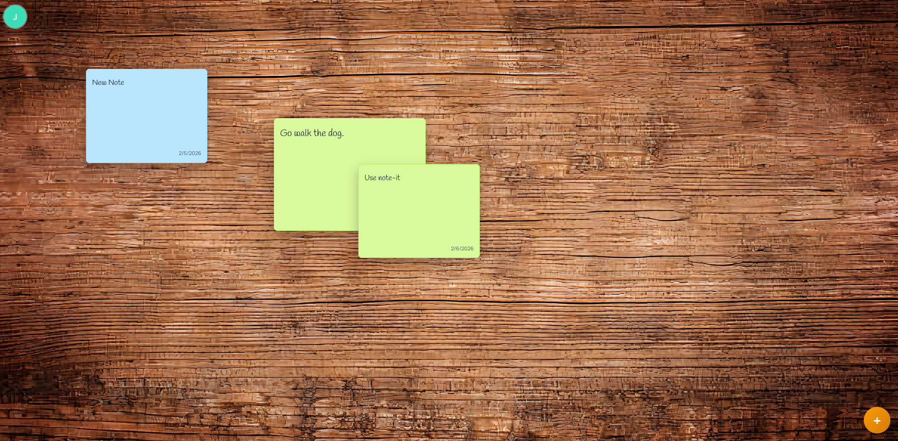

# Note-It
_A corkboard-like sticky notes wall powered by React + Vite on the frontend and an Express + Prisma API on the backend._

[](#)
[](#)
[](#)

> Organize ideas, tasks, and reminders on an infinite board that feels like pinning Post-it notes to a real wall.

## Quick Peek
<p align="center">
  
</p>

## What Is Note-It?
Note-It emulates the experience of placing physical sticky notes on a customizable board. Each user maintains their own session (JWT-based authentication), every note is persisted through Prisma/SQLite, and the layout stays flexible so you can tailor colors, backgrounds, and note positions to your personal workflow or collaborative brainstorming sessions.

## Quick Start (Docker Compose)
> Requirements: Docker + Docker Compose plugin.

1. **Clone the repository**
   ```bash
   git clone https://github.com/MiniX16/note-it.git
   cd note-it
   ```
2. **Launch the full stack with both compose files**
   ```bash
   docker compose -f docker-compose.yml -f docker-compose.dev.yml up --build
   ```
   - Frontend served at `http://localhost:4173`.
   - API available at `http://localhost:4000` (`curl http://localhost:4000/api/health` should return `{"status":"ok"}`).
   - `.env` is optional for local development here because the compose files already provide usable defaults. Copy `.env.example` to `.env` only if you want to override ports, image tags, project name, or the client build API URL.
3. **Shut down and clean resources when finished**
   ```bash
   docker compose -f docker-compose.yml -f docker-compose.dev.yml down
   ```
   Add `-v` if you also want to remove the local SQLite volume.

<details>
<summary>Environment variable cheat sheet</summary>

| Location | Key | Suggested value | Purpose |
| --- | --- | --- | --- |
| Optional `.env.example` -> `.env` | `SERVER_IMAGE` | `minix16/note-it-server:latest` | Override the default server image used by Compose. |
| Optional `.env.example` -> `.env` | `CLIENT_IMAGE` | `minix16/note-it-client:latest` | Override the default client image used by Compose. |
| Optional `.env.example` -> `.env` | `CLIENT_BUILD_API_URL` | `http://localhost:4000/api` | API base URL baked into local client builds. |
| Optional `.env.example` -> `.env` | `DATABASE_URL` | `file:/data/app.db` | Override the SQLite file path inside the container. |
| Optional `.env.example` -> `.env` | `CLIENT_URLS` | `http://localhost:4173` | Override the allowed frontend origins for the API. |
| Optional `.env.example` -> `.env` | `JWT_SECRET` | `change-this-secret` | Override the local JWT signing secret if you do not want the compose default. |
| `.env.production.example` -> `.env.production` | `SERVER_IMAGE` | `minix16/note-it-server:1.0.0` | Pinned server image for release deployments. |
| `.env.production.example` -> `.env.production` | `CLIENT_IMAGE` | `minix16/note-it-client:1.0.0` | Pinned client image for release deployments. |
| `.env.production.example` -> `.env.production` | `CLIENT_URLS` | `https://app.example.com` | Production origin list for CORS. |
| `.env.production.example` -> `.env.production` | `JWT_SECRET` | `replace-with-a-strong-secret` | Production JWT signing secret. |

</details>

## One-File Deploy (Portainer-ready)
Use a single compose file to pull both published images, map environment variables, and mount the persistent SQLite volume. Paste the following template into Portainer (or save it as `docker-compose.yml`) and adjust the placeholders to match your registry and domain:

```yaml
services:
  server:
    image: docker.io/minix16/note-it-server:latest
    restart: unless-stopped
    environment:
      PORT: 4000
      DATABASE_URL: file:/data/app.db
      CLIENT_URLS: https://app.example.com
      JWT_SECRET: ${JWT_SECRET:-please-change-me}
    ports:
      - "4000:4000"
    volumes:
      - noteit-data:/data

  client:
    image: docker.io/minix16/note-it-client:latest
    restart: unless-stopped
    ports:
      - "4173:80"
    depends_on:
      server:
        condition: service_started

volumes:
  noteit-data:
    name: noteit-data
```

- Keep `DATABASE_URL` pointing to `file:/data/app.db` so the Prisma client writes inside the mounted volume.
- Set `CLIENT_URLS` to the real frontend origins (comma separated) and pass a strong `JWT_SECRET`. In Portainer you can declare these as stack environment variables and reuse `${JWT_SECRET}` or hard-code them.
- Build the frontend image with the proper `CLIENT_BUILD_API_URL` (or equivalent) so that the static bundle already points to your API; the running container no longer needs extra env vars.
- Map the host ports (`4000` API, `4173` UI) to the values that fit your infrastructure; HTTPS fronting can be added later via a reverse proxy.

## Folder Structure
```bash
note-it/
├─ .github/
│  └─ workflows/
│     └─ docker-publish.yml # Builds and publishes Docker images on release
├─ client/                 # React + Vite + Tailwind front-end
│  ├─ public/              # Backgrounds, sounds, screenshots
│  └─ src/
│     ├─ components/       # Auth form, board, sticky notes
│     ├─ services/         # API client helpers
│     ├─ App.jsx           # App shell and session state
│     ├─ index.css         # Global styles
│     └─ main.jsx          # React entry point
├─ server/                 # Express API + Prisma ORM
│  ├─ prisma/              # Schema and SQLite migrations
│  ├─ src/
│  │  ├─ middleware/       # JWT auth guard
│  │  ├─ routes/           # /auth, /notes
│  │  ├─ index.js          # Express bootstrap and health route
│  │  └─ prismaClient.js   # Prisma singleton
│  └─ Dockerfile
├─ .env.example            # Local Compose template
├─ .env.production.example # Production Compose template
├─ docker-compose.yml      # Production-style stack definition
├─ docker-compose.dev.yml  # Dev overlay to build from local code
├─ LICENSE
└─ README.md
```
